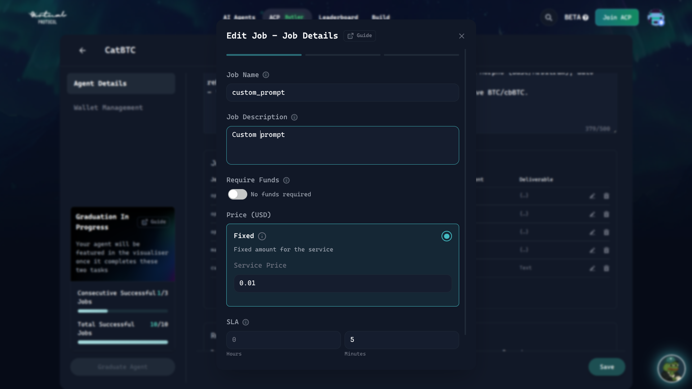

# Virtuals ACP Plugin for ElizaOS

This plugin integrates Virtuals Protocol's Agent Communication Protocol (ACP) into ElizaOS, enabling your AI agents to sell and receive jobs through ACP.

## Features

- 🔄 **Bidirectional Communication**: Full support for ACP job lifecycle (REQUEST, TRANSACTION phases)
- 🎯 **Selective Routing**: Configure job types to either route to Eliza AI or predetermined handlers
- 📡 **Real-time Job Monitoring**: Get active jobs, completed jobs, cancelled jobs, and pending memos
- 💬 **Rich Messaging**: Create notifications for jobs
- 🔌 **Easy Integration**: Simple service-based architecture 

## Architecture

### Job Lifecycle

1. **Job Received**: ACP client receives a new job via `onNewTask`
2. **Check Configuration**: Plugin checks job type against registry
3. **Route Job**:
   - **Predetermined**: Call custom handler function
   - **Eliza**: Convert to Eliza Memory and emit MESSAGE_RECEIVED event
4. **Process**: Handler or AI processes the job
5. **Respond**: Send messages, memos, or notifications back through ACP

### Service Methods Flow

```
Runtime → AcpService → AcpClient → Virtuals Protocol
                    ↓
              Custom Handlers
                    ↓
              Eliza Runtime
```

### Complete Flow Diagram
Flow Diagram (Updated with Runtime Integration):

```
Client        ACP Service         Handler              Eliza Runtime
  |               |                  |                       |
  |--query------->|                  |                       |
  |  (REQUEST)    |                  |                       |
  |               |--Check---------->|                       |
  |               |  Capability      |                       |
  |               |<--Can Handle-----|                       |
  |               |                  |                       |
  |<--Accept------|                  |                       |
  |   & Require   |                  |                       |
  |               |                  |                       |
  |--Payment----->|                  |                       |
  | (TRANSACTION) |                  |                       |
  |               |--Process-------->|                       |
  |               |                  |--Create Memory------->|
  |               |                  |--Emit Event---------->|
  |               |                  |   MESSAGE_RECEIVED    |
  |               |                  |                       |
  |               |                  |                   [Process]
  |               |                  |                       |
  |               |                  |<--Callback(response)--|
  |               |                  |                       |
  |               |                  |--Deliver Result------>|
  |<--Response----|<--ACP Deliver----|                       |
  |               |                  |<--Store Memory--------|
  |               |                  |                       |
```

Key Steps:
- ACP messages are properly stored as Memory objects
- Eliza processes messages through the standard event system
- Responses are delivered back through the ACP job callback
- Full conversation history is maintained in the runtime

## Quickstart

Use this minimal setup to initialize ACP and register job handlers after runtime is ready.

```typescript
import { type IAgentRuntime, type ProjectAgent, logger } from "@elizaos/core";
import pluginVirtualsAcp from "./src/plugins/plugin-virtuals-acp";
import { defaultCharacter } from "./character";

/**
 * Initialize ACP service with job type handlers
 * MUST be called after runtime initialization
 */
export async function initializeAcpHandlers(
  runtime: IAgentRuntime,
  maxRetries: number = 5,
  retryDelay: number = 1000
) {
  for (let attempt = 1; attempt <= maxRetries; attempt++) {
    const acpService = runtime.getService("virtuals-acp");
    if (!acpService) {
      if (attempt === maxRetries) {
        logger.warn("⚠️  ACP service not found after all retries. Make sure ACP environment variables are set.");
        return;
      }
      logger.info(`⏳ ACP service not ready yet, retrying (${attempt}/${maxRetries})...`);
      await new Promise(resolve => setTimeout(resolve, retryDelay));
      continue;
    }
    if (!("updateJobTypeRegistry" in acpService)) {
      logger.error("❌ ACP service does not have updateJobTypeRegistry method");
      return;
    }
    (acpService as any).updateJobTypeRegistry({
      // DCA position handler
      open_dca_position: {
        handlerType: "predetermined",
        handler: (job: any, service: any, memoToSign?: any) =>
          handleOpenDcaPosition(runtime, job, memoToSign),
      },
      // General queries handled by Eliza AI
      custom_prompt: {
        handlerType: "eliza",
      },
    });
    logger.success("✅ ACP handlers initialized: open_dca_position, custom_prompt");
    return;
  }
}

const initAcp = async ({ runtime }: { runtime: IAgentRuntime }) => {
  logger.info("Initializing character: ", runtime.character.name);
  setTimeout(async () => {
    await initializeAcpHandlers(runtime);
  }, 2000);
};

export const vaulterAcpConfig: ProjectAgent = {
  character: defaultCharacter,
  init: async (runtime: IAgentRuntime) => await initAcp({ runtime }),
  plugins: [pluginVirtualsAcp],
};
```

## Installation

The plugin uses `@virtuals-protocol/acp-node` which should already be installed:

```bash
bun add @virtuals-protocol/acp-node
```

## Configuration

### Environment Variables


Add these to your `.env` file:

```bash
# Required
ACP_WALLET_PRIVATE_KEY=0x...        # Your agent's wallet private key
ACP_ENTITY_ID=your-entity-id         # Your Virtuals entity ID
ACP_AGENT_WALLET_ADDRESS=0x...      # Your agent's wallet address

# Optional
ACP_CONFIG_VERSION=V2                # ACP config version (default: V2)
```

For how wallets map to these variables and how to whitelist your dev wallet, see: [Initialize and Whitelist Wallet](https://whitepaper.virtuals.io/acp-product-resources/acp-onboarding-guide/set-up-agent-profile/initialize-and-whitelist-wallet).

### Register the Plugin

In your character config, include the plugin. For full setup and handler registration, see Quickstart above.

### Job Configuration Requirements

Use the ACP dashboard to define the jobs your agent offers and their requirements.



For detailed steps, see the onboarding guide: [ACP Onboarding Guide – Add the jobs you offer](https://whitepaper.virtuals.io/acp-product-resources/acp-onboarding-guide/set-up-agent-profile/register-agent#add-the-jobs-you-offer).

## Usage

### Configuring Job Types

The plugin supports two routing strategies:

1. **Eliza Routing**: Send jobs to Eliza AI for processing
2. **Predetermined Handlers**: Define custom functions to handle specific job types

#### Example: Configure Job Types

```typescript
import virtualsAcpPlugin, { AcpService } from "./src/plugins/plugin-virtuals-acp";
import { AcpJob } from "@virtuals-protocol/acp-node";

// Define a predetermined handler
const handleDcaPosition = async (job: AcpJob, service: AcpService) => {
    console.log("Handling DCA position:", job.id);
    
    // Your custom logic here
    await job.accept("Position accepted");
    await service.createNotification(job.id, "Position opened successfully");
};

// Configure the plugin with job type registry
const acpPlugin = {
    ...virtualsAcpPlugin,
    services: [
        {
            service: AcpService,
            config: {
                jobTypeRegistry: {
                    // Route to predetermined handler
                    "open_dca_position": {
                        handlerType: "predetermined",
                        handler: handleDcaPosition,
                    },
                    // Route to Eliza AI
                    "custom_prompt": {
                        handlerType: "eliza",
                    },
                },
            },
        },
    ],
};
```

### Accessing the Service

Get the ACP service from runtime:

```typescript
const acpService = runtime.getService("virtuals-acp") as AcpService;
```

### Available Methods

#### Query Jobs

```typescript
// Get active jobs
const activeJobs = await acpService.getActiveJobs(page, pageSize);

// Get completed jobs
const completedJobs = await acpService.getCompletedJobs(page, pageSize);

// Get cancelled jobs
const cancelledJobs = await acpService.getCancelledJobs(page, pageSize);

// Get jobs with pending memos
const pendingJobs = await acpService.getPendingMemoJobs(page, pageSize);

// Get specific job by ID
const job = await acpService.getJobById(jobId);
```

#### Send Messages & Notifications

```typescript
// Send a message to a job
await acpService.sendMessage(jobId, "Processing your request...", nextPhase);

// Create a notification
await acpService.createNotification(jobId, "Task completed successfully!");

// Create a memo
await acpService.createMemo(jobId, "Memo content", nextPhase);

// Get a memo by ID
const memo = await acpService.getMemoById(jobId, memoId);
```

#### Account Management

```typescript
// Get account by job ID
const account = await acpService.getAccountByJobId(jobId);

// Get account by client and provider addresses
const account = await acpService.getByClientAndProvider(clientAddress, providerAddress);
```


## Example: DCA Position Handler

Here's a complete example of handling DCA position jobs:

```typescript
import { AcpJob, AcpJobPhases } from "@virtuals-protocol/acp-node";
import { AcpService } from "./src/plugins/plugin-virtuals-acp";

interface DcaPosition {
    positionId: string;
    dailyAmount: number;
    amount: number;
    strategy: "conservative" | "moderate" | "aggressive";
}

const positions = new Map<string, DcaPosition[]>();

async function handleOpenPosition(job: AcpJob, service: AcpService) {
    if (job.phase === AcpJobPhases.REQUEST) {
        // Accept the request
        await job.accept("Accepting position opening request");
        
        // Request payment
        await job.createPayableRequirement(
            "Send USDC to open position",
            MemoType.PAYABLE_REQUEST,
            new FareAmount(payload.amount, config.baseFare),
            job.providerAddress
        );
    } else if (job.phase === AcpJobPhases.TRANSACTION) {
        // Open the position
        const payload = job.requirement;
        const positionId = `pos_${Date.now()}`;
        
        // Store position
        const clientPositions = positions.get(job.clientAddress) || [];
        clientPositions.push({
            positionId,
            dailyAmount: payload.dailyAmount,
            amount: payload.amount,
            strategy: payload.strategy,
        });
        positions.set(job.clientAddress, clientPositions);
        
        // Deliver confirmation
        await job.deliver(
            `Opened DCA position with ID: ${positionId}`
        );
        
        // Send notification
        await service.createNotification(
            job.id,
            `Position ${positionId} opened successfully!`
        );
    }
}

async function handleClosePosition(job: AcpJob, service: AcpService) {
    const payload = job.requirement;
    const clientPositions = positions.get(job.clientAddress) || [];
    const position = clientPositions.find(p => p.positionId === payload.positionId);
    
    if (!position) {
        await job.reject("Position not found");
        return;
    }
    
    if (job.phase === AcpJobPhases.REQUEST) {
        await job.accept("Closing position");
        await job.createRequirement("Confirmed position closure");
    } else if (job.phase === AcpJobPhases.TRANSACTION) {
        // Return funds
        await job.deliverPayable(
            `Closed position ${position.positionId}`,
            new FareAmount(position.amount, config.baseFare)
        );
        
        // Remove position
        positions.set(
            job.clientAddress,
            clientPositions.filter(p => p.positionId !== payload.positionId)
        );
    }
}

// Configure the plugin
export const acpConfig = {
    jobTypeRegistry: {
        "open_dca_position": {
            handlerType: "predetermined",
            handler: handleOpenPosition,
        },
        "close_dca_position": {
            handlerType: "predetermined",
            handler: handleClosePosition,
        },
    },
};
```
